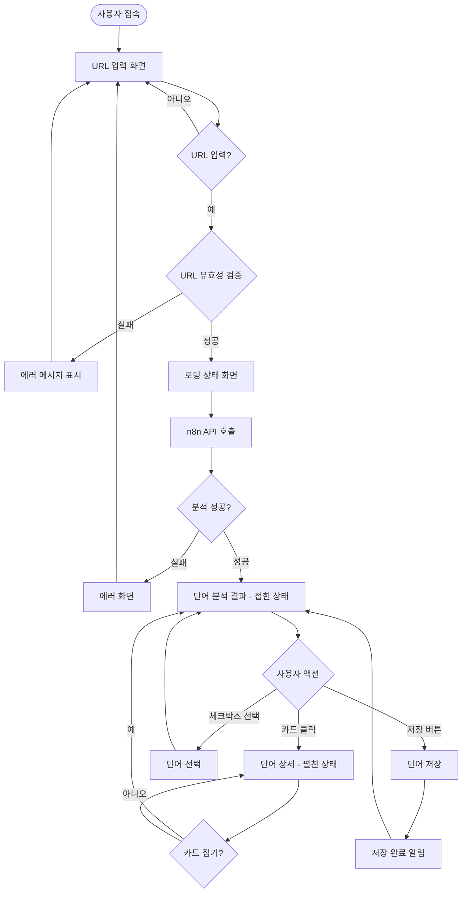
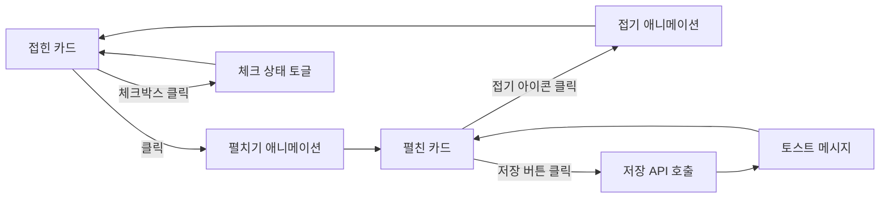
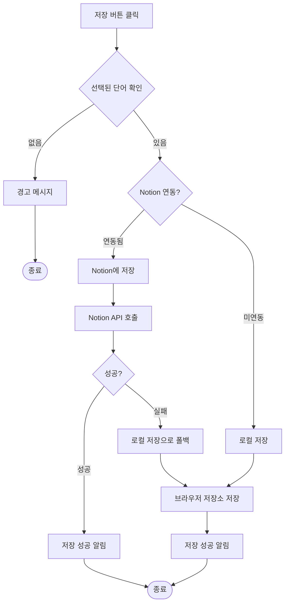

# TweetLingo 와이어프레임

> 웹 애플리케이션 MVP 화면 설계  
> 작성일: 2026년 1월 22일  
> 버전: 1.0

---

## 목차

1. [디자인 시스템](#1-디자인-시스템)
2. [화면 1: URL 입력 화면](#2-화면-1-url-입력-화면)
3. [화면 2: 단어 분석 결과 (접힌 상태)](#3-화면-2-단어-분석-결과-접힌-상태)
4. [화면 3: 단어 상세 (펼친 상태)](#4-화면-3-단어-상세-펼친-상태)
5. [화면 4: 로딩 상태](#5-화면-4-로딩-상태)
6. [인터랙션 흐름도](#6-인터랙션-흐름도)
7. [UI 컴포넌트 명세](#7-ui-컴포넌트-명세)

---

## 1. 디자인 시스템

### 1.1 컬러 팔레트 (파스텔 톤)

| 용도 | 컬러명 | HEX | 사용처 |
|------|--------|-----|--------|
| Primary | Sky Pastel | `#89CFF0` | 주요 버튼, 액션 요소 |
| Secondary | Light Sky | `#D4F1F4` | 카드 배경, 보조 요소 |
| Background | Soft White | `#F8FCFF` | 전체 배경 |
| Text Primary | Soft Gray | `#4A5568` | 본문 텍스트 |
| Text Secondary | Light Gray | `#718096` | 보조 텍스트 |
| Accent | Mid Sky | `#B8E6F0` | 하이라이트, 호버 상태 |
| Border | Pale Blue | `#E0F2F7` | 테두리, 구분선 |

### 1.2 타이포그래피

| 요소 | 폰트 크기 | 폰트 굵기 | 용도 |
|------|----------|----------|------|
| H1 | 32px | 700 (Bold) | 페이지 타이틀 |
| H2 | 24px | 600 (SemiBold) | 섹션 제목 |
| H3 | 20px | 600 (SemiBold) | 카드 제목 |
| Body | 16px | 400 (Regular) | 본문 텍스트 |
| Caption | 14px | 400 (Regular) | 보조 텍스트 |
| Small | 12px | 400 (Regular) | 메타 정보 |

### 1.3 간격 시스템

- **XS**: 4px
- **S**: 8px
- **M**: 16px
- **L**: 24px
- **XL**: 32px
- **XXL**: 48px

### 1.4 카드 스타일

- **배경**: `#FFFFFF` (화이트)
- **테두리**: `1px solid #E0F2F7`
- **모서리**: `12px` (부드러운 라운드)
- **그림자**: `0 2px 8px rgba(137, 207, 240, 0.1)`
- **호버 그림자**: `0 4px 16px rgba(137, 207, 240, 0.2)`

---

## 2. 화면 1: URL 입력 화면

### 2.1 와이어프레임

```
┌────────────────────────────────────────────────────────────────┐
│                         [데스크톱: 1200px]                      │
│                                                                │
│  ┌──────────────────────────────────────────────────────────┐ │
│  │  Header                        (#F8FCFF 배경)             │ │
│  │  ┌─────────────────────────────────────────────────────┐  │ │
│  │  │                                                      │  │ │
│  │  │   🐦 TweetLingo     (#89CFF0 로고)                   │  │ │
│  │  │                                                      │  │ │
│  │  └─────────────────────────────────────────────────────┘  │ │
│  └──────────────────────────────────────────────────────────┘ │
│                                                                │
│                      [수직 중앙 정렬 영역]                      │
│                                                                │
│  ┌──────────────────────────────────────────────────────────┐ │
│  │                    Main Content                           │ │
│  │                                                           │ │
│  │        ┌─────────────────────────────────────┐           │ │
│  │        │  🌍                                 │           │ │
│  │        │  Learn languages,                   │           │ │
│  │        │  one tweet at a time                │           │ │
│  │        │                                     │           │ │
│  │        │  (#4A5568, 32px Bold)               │           │ │
│  │        └─────────────────────────────────────┘           │ │
│  │                                                           │ │
│  │        ┌─────────────────────────────────────┐           │ │
│  │        │  X에서 외국어 트윗을 읽을 때,         │           │ │
│  │        │  주요 단어를 자동으로 추출하고        │           │ │
│  │        │  학습할 수 있도록 돕습니다           │           │ │
│  │        │  (#718096, 16px Regular)            │           │ │
│  │        └─────────────────────────────────────┘           │ │
│  │                                                           │ │
│  │        ┌─────────────────────────────────────┐           │ │
│  │        │  ┌──────────────────────────────┐   │           │ │
│  │        │  │  🔗 트윗 URL을 입력하세요...   │   │           │ │
│  │        │  │                              │   │           │ │
│  │        │  │  (#FFFFFF 배경, #E0F2F7 테두리)│   │           │ │
│  │        │  │  (높이: 56px, 패딩: 16px)     │   │           │ │
│  │        │  └──────────────────────────────┘   │           │ │
│  │        │                                     │           │ │
│  │        │  ┌──────────────────────────────┐   │           │ │
│  │        │  │      분석하기 →              │   │           │ │
│  │        │  │  (#89CFF0 배경, #FFFFFF 텍스트)│   │           │ │
│  │        │  │  (높이: 48px, 라운드: 24px)   │   │           │ │
│  │        │  └──────────────────────────────┘   │           │ │
│  │        └─────────────────────────────────────┘           │ │
│  │                                                           │ │
│  │        ┌─────────────────────────────────────┐           │ │
│  │        │  지원 언어                           │           │ │
│  │        │  🇬🇧 영어  🇯🇵 일본어  🇨🇳 중국어      │           │ │
│  │        │  (#718096, 14px)                    │           │ │
│  │        └─────────────────────────────────────┘           │ │
│  │                                                           │ │
│  └──────────────────────────────────────────────────────────┘ │
│                                                                │
│  ┌──────────────────────────────────────────────────────────┐ │
│  │  Footer                                                   │ │
│  │  ┌─────────────────────────────────────────────────────┐ │ │
│  │  │  © 2026 TweetLingo  |  문의  |  개인정보처리방침     │ │ │
│  │  │  (#718096, 12px)                                     │ │ │
│  │  └─────────────────────────────────────────────────────┘ │ │
│  └──────────────────────────────────────────────────────────┘ │
│                                                                │
└────────────────────────────────────────────────────────────────┘
```

### 2.2 모바일 레이아웃 (320px ~ 768px)

```
┌──────────────────────────┐
│   [모바일: 375px]        │
│                          │
│  ┌────────────────────┐  │
│  │  Header            │  │
│  │  🐦 TweetLingo     │  │
│  │  (중앙 정렬)        │  │
│  └────────────────────┘  │
│                          │
│  ┌────────────────────┐  │
│  │  Main Content      │  │
│  │                    │  │
│  │  🌍                │  │
│  │  Learn languages,  │  │
│  │  one tweet at      │  │
│  │  a time            │  │
│  │  (24px Bold)       │  │
│  │                    │  │
│  │  X에서 외국어       │  │
│  │  트윗을 읽을 때...  │  │
│  │  (14px Regular)    │  │
│  │                    │  │
│  │  ┌──────────────┐  │  │
│  │  │ 🔗 트윗 URL   │  │  │
│  │  │ 을 입력...    │  │  │
│  │  └──────────────┘  │  │
│  │                    │  │
│  │  ┌──────────────┐  │  │
│  │  │ 분석하기 →    │  │  │
│  │  └──────────────┘  │  │
│  │                    │  │
│  │  지원 언어          │  │
│  │  🇬🇧 🇯🇵 🇨🇳       │  │
│  │                    │  │
│  └────────────────────┘  │
│                          │
└──────────────────────────┘
```

### 2.3 상태 및 인터랙션

#### 초기 상태
- URL 입력 필드: 비활성화 (플레이스홀더 표시)
- 분석하기 버튼: 비활성화 (회색 처리)

#### 입력 중 상태
- URL 입력 필드: 활성화 (포커스 시 `#89CFF0` 테두리)
- 분석하기 버튼: URL 형식 유효 시 활성화

#### 호버 상태
- 분석하기 버튼: 배경 `#B8E6F0` (밝은 하늘색)
- 그림자 강화

#### 에러 상태
- URL 입력 필드: 빨간색 테두리 `#FCA5A5`
- 에러 메시지: "올바른 X 트윗 URL을 입력해주세요" (빨간색 텍스트)

---

## 3. 화면 2: 단어 분석 결과 (접힌 상태)

### 3.1 와이어프레임

```
┌────────────────────────────────────────────────────────────────┐
│                         [데스크톱: 1200px]                      │
│                                                                │
│  ┌──────────────────────────────────────────────────────────┐ │
│  │  Header                                                   │ │
│  │  🐦 TweetLingo        [← 뒤로]  [설정 ⚙️]                 │ │
│  └──────────────────────────────────────────────────────────┘ │
│                                                                │
│  ┌──────────────────────────────────────────────────────────┐ │
│  │  원본 트윗 박스          (#FFFFFF 배경, #E0F2F7 테두리)     │ │
│  │  ┌─────────────────────────────────────────────────────┐ │ │
│  │  │  📄                                                  │ │ │
│  │  │  "Just finished reading an amazing book about #AI!  │ │ │
│  │  │   Can't wait to apply these concepts. 🤖"           │ │ │
│  │  │                                                      │ │ │
│  │  │  (#4A5568, 16px, 줄간격: 1.6)                        │ │ │
│  │  │                                                      │ │ │
│  │  │  🔗 원본 트윗 보기                                    │ │ │
│  │  │  (#89CFF0 링크)                                      │ │ │
│  │  └─────────────────────────────────────────────────────┘ │ │
│  └──────────────────────────────────────────────────────────┘ │
│                                                                │
│  ┌──────────────────────────────────────────────────────────┐ │
│  │  추출된 단어 (5개)                (#4A5568, 20px Bold)     │ │
│  │  ☑️ 모두 선택         [선택한 단어 저장하기 💾]             │ │
│  └──────────────────────────────────────────────────────────┘ │
│                                                                │
│  ┌──────────────────────────────────────────────────────────┐ │
│  │  단어 카드 1          (#FFFFFF 배경, shadow)              │ │
│  │  ┌─────────────────────────────────────────────────────┐ │ │
│  │  │  ☑️   finish                              ⌄         │ │ │
│  │  │       끝내다, 완료하다                                │ │ │
│  │  │                                                      │ │ │
│  │  │       (#4A5568, 18px Bold / #718096, 14px)          │ │ │
│  │  │       동사 · verb                                    │ │ │
│  │  └─────────────────────────────────────────────────────┘ │ │
│  └──────────────────────────────────────────────────────────┘ │
│                                                                │
│  ┌──────────────────────────────────────────────────────────┐ │
│  │  단어 카드 2                                              │ │
│  │  ┌─────────────────────────────────────────────────────┐ │ │
│  │  │  ☑️   reading                             ⌄         │ │ │
│  │  │       읽기, 독서                                     │ │ │
│  │  │                                                      │ │ │
│  │  │       명사 · noun                                    │ │ │
│  │  └─────────────────────────────────────────────────────┘ │ │
│  └──────────────────────────────────────────────────────────┘ │
│                                                                │
│  ┌──────────────────────────────────────────────────────────┐ │
│  │  단어 카드 3                                              │ │
│  │  ┌─────────────────────────────────────────────────────┐ │ │
│  │  │  ☑️   amazing                             ⌄         │ │ │
│  │  │       놀라운, 굉장한                                  │ │ │
│  │  │                                                      │ │ │
│  │  │       형용사 · adjective                             │ │ │
│  │  └─────────────────────────────────────────────────────┘ │ │
│  └──────────────────────────────────────────────────────────┘ │
│                                                                │
│  ┌──────────────────────────────────────────────────────────┐ │
│  │  단어 카드 4                                              │ │
│  │  ┌─────────────────────────────────────────────────────┐ │ │
│  │  │  ☑️   book                                ⌄         │ │ │
│  │  │       책, 서적                                       │ │ │
│  │  │                                                      │ │ │
│  │  │       명사 · noun                                    │ │ │
│  │  └─────────────────────────────────────────────────────┘ │ │
│  └──────────────────────────────────────────────────────────┘ │
│                                                                │
│  ┌──────────────────────────────────────────────────────────┐ │
│  │  단어 카드 5                                              │ │
│  │  ┌─────────────────────────────────────────────────────┐ │ │
│  │  │  ☑️   apply                               ⌄         │ │ │
│  │  │       적용하다, 신청하다                              │ │ │
│  │  │                                                      │ │ │
│  │  │       동사 · verb                                    │ │ │
│  │  └─────────────────────────────────────────────────────┘ │ │
│  └──────────────────────────────────────────────────────────┘ │
│                                                                │
│  ┌──────────────────────────────────────────────────────────┐ │
│  │  ┌────────────────────────────────────────────────────┐  │ │
│  │  │         선택한 단어 저장하기 (3개) 💾               │  │ │
│  │  │         (#89CFF0 배경, 48px 높이)                   │  │ │
│  │  └────────────────────────────────────────────────────┘  │ │
│  └──────────────────────────────────────────────────────────┘ │
│                                                                │
└────────────────────────────────────────────────────────────────┘
```

### 3.2 카드 상태별 디자인

#### 기본 상태 (접힌 상태)
```
┌─────────────────────────────────────────────┐
│  ☑️   finish                       ⌄        │
│       끝내다, 완료하다                        │
│                                             │
│       동사 · verb                           │
│       (#D4F1F4 배경, 12px, 라운드 코너)      │
└─────────────────────────────────────────────┘
```

#### 호버 상태
```
┌─────────────────────────────────────────────┐
│  ☑️   finish                       ⌄        │  ← 커서 포인터
│       끝내다, 완료하다                        │
│                                             │
│       동사 · verb                           │
│       (#B8E6F0 배경 변화)                   │
│       (그림자 강화)                          │
└─────────────────────────────────────────────┘
```

#### 체크 해제 상태
```
┌─────────────────────────────────────────────┐
│  ☐   finish                       ⌄        │
│       끝내다, 완료하다                        │
│       (투명도 60%)                           │
│                                             │
│       동사 · verb                           │
└─────────────────────────────────────────────┘
```

### 3.3 상단 액션바

```
┌──────────────────────────────────────────────────────┐
│  추출된 단어 (5개)         (#4A5568, 20px Bold)       │
│                                                      │
│  ┌──────────────┐           ┌──────────────────┐    │
│  │ ☑️ 모두 선택  │           │ 선택한 단어 저장  │    │
│  │ (#718096)    │           │ (#89CFF0 배경)   │    │
│  └──────────────┘           └──────────────────┘    │
└──────────────────────────────────────────────────────┘
```

---

## 4. 화면 3: 단어 상세 (펼친 상태)

### 4.1 와이어프레임

```
┌────────────────────────────────────────────────────────────────┐
│                         [데스크톱: 1200px]                      │
│                                                                │
│  ┌──────────────────────────────────────────────────────────┐ │
│  │  Header                                                   │ │
│  │  🐦 TweetLingo        [← 뒤로]  [설정 ⚙️]                 │ │
│  └──────────────────────────────────────────────────────────┘ │
│                                                                │
│  ┌──────────────────────────────────────────────────────────┐ │
│  │  원본 트윗 박스                                            │ │
│  │  "Just finished reading an amazing book about #AI!..."    │ │
│  └──────────────────────────────────────────────────────────┘ │
│                                                                │
│  ┌──────────────────────────────────────────────────────────┐ │
│  │  추출된 단어 (5개)                                         │ │
│  │  ☑️ 모두 선택         [선택한 단어 저장하기 💾]             │ │
│  └──────────────────────────────────────────────────────────┘ │
│                                                                │
│  ┌──────────────────────────────────────────────────────────┐ │
│  │  단어 카드 1 - 펼친 상태     (#FFFFFF 배경, shadow 강화)   │ │
│  │  ┌─────────────────────────────────────────────────────┐ │ │
│  │  │  ☑️   finish                              ⌃         │ │ │
│  │  │       (접기 아이콘 위로)                              │ │ │
│  │  │  ━━━━━━━━━━━━━━━━━━━━━━━━━━━━━━━━━━━━━━━━━━━━━━━━━ │ │ │
│  │  │                                                      │ │ │
│  │  │  finish                                              │ │ │
│  │  │  (#4A5568, 28px Bold)                                │ │ │
│  │  │                                                      │ │ │
│  │  │  끝내다, 완료하다, 마치다                              │ │ │
│  │  │  (#4A5568, 18px Regular)                             │ │ │
│  │  │                                                      │ │ │
│  │  │  ┌─────────────────────────────────────────────┐    │ │ │
│  │  │  │  발음                                        │    │ │ │
│  │  │  │  [ˈfɪnɪʃ]  /  피니쉬                        │    │ │ │
│  │  │  │  (#718096, 16px)                            │    │ │ │
│  │  │  │  (#D4F1F4 배경, 패딩: 12px)                 │    │ │ │
│  │  │  └─────────────────────────────────────────────┘    │ │ │
│  │  │                                                      │ │ │
│  │  │  ┌─────────────────────────────────────────────┐    │ │ │
│  │  │  │  품사                                        │    │ │ │
│  │  │  │  동사 · verb                                │    │ │ │
│  │  │  │  (#89CFF0 배경, 라운드 뱃지)                │    │ │ │
│  │  │  └─────────────────────────────────────────────┘    │ │ │
│  │  │                                                      │ │ │
│  │  │  ┌─────────────────────────────────────────────┐    │ │ │
│  │  │  │  예문                                        │    │ │ │
│  │  │  │  "Just **finished** reading an amazing      │    │ │ │
│  │  │  │   book about #AI!"                          │    │ │ │
│  │  │  │                                              │    │ │ │
│  │  │  │  (**finished** 부분 하이라이트: #B8E6F0)     │    │ │ │
│  │  │  │  (#4A5568, 16px, 줄간격: 1.6)               │    │ │ │
│  │  │  │  (#F8FCFF 배경, 패딩: 16px)                 │    │ │ │
│  │  │  └─────────────────────────────────────────────┘    │ │ │
│  │  │                                                      │ │ │
│  │  │  ┌─────────────────────────────────────────────┐    │ │ │
│  │  │  │         이 단어만 저장하기 💾                │    │ │ │
│  │  │  │         (#89CFF0 배경, #FFFFFF 텍스트)       │    │ │ │
│  │  │  │         (높이: 44px, 라운드: 22px)           │    │ │ │
│  │  │  └─────────────────────────────────────────────┘    │ │ │
│  │  │                                                      │ │ │
│  │  └─────────────────────────────────────────────────────┘ │ │
│  └──────────────────────────────────────────────────────────┘ │
│                                                                │
│  ┌──────────────────────────────────────────────────────────┐ │
│  │  단어 카드 2 - 접힌 상태                                   │ │
│  │  ┌─────────────────────────────────────────────────────┐ │ │
│  │  │  ☑️   reading                             ⌄         │ │ │
│  │  │       읽기, 독서                                     │ │ │
│  │  │       명사 · noun                                    │ │ │
│  │  └─────────────────────────────────────────────────────┘ │ │
│  └──────────────────────────────────────────────────────────┘ │
│                                                                │
│  [나머지 접힌 카드들...]                                        │
│                                                                │
└────────────────────────────────────────────────────────────────┘
```

### 4.2 펼친 카드 상세 요소

#### 발음 섹션
```
┌─────────────────────────────────────────────┐
│  발음                                        │
│  [ˈfɪnɪʃ]  /  피니쉬         🔊             │
│  (#718096, 16px)                            │
│  (#D4F1F4 배경, 패딩: 12px, 라운드: 8px)    │
└─────────────────────────────────────────────┘
```

#### 품사 뱃지
```
┌──────────────┐
│  동사 · verb  │
│  (#89CFF0 배경, #FFFFFF 텍스트)
│  (패딩: 6px 12px, 라운드: 12px)
│  (12px, Medium)
└──────────────┘
```

#### 예문 박스
```
┌─────────────────────────────────────────────┐
│  예문                                        │
│                                             │
│  "Just **finished** reading an amazing      │
│   book about #AI!"                          │
│                                             │
│  (**finished** 하이라이트: #B8E6F0 배경)     │
│  (#F8FCFF 배경, 패딩: 16px, 라운드: 8px)    │
│  (이탤릭 스타일, 16px)                       │
└─────────────────────────────────────────────┘
```

### 4.3 애니메이션

#### 펼치기 애니메이션
- **지속 시간**: 300ms
- **이징**: ease-out
- **효과**: 높이 확장 + 페이드 인

#### 접기 애니메이션
- **지속 시간**: 250ms
- **이징**: ease-in
- **효과**: 높이 축소 + 페이드 아웃

---

## 5. 화면 4: 로딩 상태

### 5.1 와이어프레임

```
┌────────────────────────────────────────────────────────────────┐
│                         [데스크톱: 1200px]                      │
│                                                                │
│  ┌──────────────────────────────────────────────────────────┐ │
│  │  Header                                                   │ │
│  │  🐦 TweetLingo                                            │ │
│  └──────────────────────────────────────────────────────────┘ │
│                                                                │
│                      [수직 중앙 정렬 영역]                      │
│                                                                │
│  ┌──────────────────────────────────────────────────────────┐ │
│  │                    Loading Content                        │ │
│  │                                                           │ │
│  │        ┌─────────────────────────────────────┐           │ │
│  │        │                                     │           │ │
│  │        │         ⌛ (애니메이션)              │           │ │
│  │        │                                     │           │ │
│  │        │         (#89CFF0 컬러)              │           │ │
│  │        │         (60px 크기)                 │           │ │
│  │        │                                     │           │ │
│  │        └─────────────────────────────────────┘           │ │
│  │                                                           │ │
│  │        ┌─────────────────────────────────────┐           │ │
│  │        │  트윗 분석 중...                     │           │ │
│  │        │  (#4A5568, 24px SemiBold)           │           │ │
│  │        └─────────────────────────────────────┘           │ │
│  │                                                           │ │
│  │        ┌─────────────────────────────────────┐           │ │
│  │        │  잠시만 기다려주세요                 │           │ │
│  │        │  주요 단어를 추출하고 있습니다        │           │ │
│  │        │  (#718096, 16px Regular)            │           │ │
│  │        └─────────────────────────────────────┘           │ │
│  │                                                           │ │
│  │        ┌─────────────────────────────────────┐           │ │
│  │        │  ▓▓▓▓▓▓▓▓▓▓░░░░░░░░░░               │           │ │
│  │        │  진행률: 60%                         │           │ │
│  │        │  (#89CFF0 프로그레스바)              │           │ │
│  │        │  (#E0F2F7 배경)                     │           │ │
│  │        │  (높이: 8px, 라운드: 4px)            │           │ │
│  │        └─────────────────────────────────────┘           │ │
│  │                                                           │ │
│  │        ┌─────────────────────────────────────┐           │ │
│  │        │  💡 Tip                              │           │ │
│  │        │  트윗에서 명사, 동사, 형용사,         │           │ │
│  │        │  부사를 자동으로 추출합니다           │           │ │
│  │        │  (#D4F1F4 배경, 패딩: 16px)          │           │ │
│  │        └─────────────────────────────────────┘           │ │
│  │                                                           │ │
│  └──────────────────────────────────────────────────────────┘ │
│                                                                │
└────────────────────────────────────────────────────────────────┘
```

### 5.2 로딩 단계별 메시지

| 단계 | 진행률 | 메시지 | 소요 시간 |
|------|--------|--------|----------|
| 1 | 0-20% | 트윗 내용을 가져오는 중... | 0.3초 |
| 2 | 20-40% | 언어를 감지하는 중... | 0.4초 |
| 3 | 40-70% | 주요 단어를 추출하는 중... | 0.6초 |
| 4 | 70-90% | 번역 및 발음 정보를 가져오는 중... | 0.5초 |
| 5 | 90-100% | 거의 완료되었습니다... | 0.2초 |

### 5.3 로딩 애니메이션

#### 스피너 애니메이션
```
⌛ 회전 애니메이션
- 회전 속도: 1.5초/회전
- 방향: 시계방향
- 컬러: #89CFF0
- 크기: 60px
- 부드러운 회전 (ease-in-out)
```

#### 프로그레스바 애니메이션
```
▓▓▓▓▓▓▓▓▓▓░░░░░░░░░░
- 진행 방향: 왼쪽에서 오른쪽
- 애니메이션 속도: 부드러운 증가
- 컬러: #89CFF0 → #B8E6F0 (그라디언트)
- 배경: #E0F2F7
```

### 5.4 스켈레톤 로딩 (대안)

```
┌────────────────────────────────────────────────────────────────┐
│  ┌──────────────────────────────────────────────────────────┐ │
│  │  원본 트윗 박스 (스켈레톤)                                 │ │
│  │  ┌─────────────────────────────────────────────────────┐ │ │
│  │  │  ░░░░░░░░░░░░░░░░░░░░░░░░░░░░░░░░░░░░░░░░░░░░░░░░  │ │ │
│  │  │  ░░░░░░░░░░░░░░░░░░░░░░░░░░░░░░░░░░░░░░            │ │ │
│  │  │  (#E0F2F7, 펄스 애니메이션)                          │ │ │
│  │  └─────────────────────────────────────────────────────┘ │ │
│  └──────────────────────────────────────────────────────────┘ │
│                                                                │
│  ┌──────────────────────────────────────────────────────────┐ │
│  │  단어 카드 스켈레톤 1                                      │ │
│  │  ┌─────────────────────────────────────────────────────┐ │ │
│  │  │  ░░░░░░░░░░░░░░                                     │ │ │
│  │  │  ░░░░░░░░░░░░░░░░░░░░                               │ │ │
│  │  └─────────────────────────────────────────────────────┘ │ │
│  └──────────────────────────────────────────────────────────┘ │
│                                                                │
│  ┌──────────────────────────────────────────────────────────┐ │
│  │  단어 카드 스켈레톤 2                                      │ │
│  │  ┌─────────────────────────────────────────────────────┐ │ │
│  │  │  ░░░░░░░░░░░░░░                                     │ │ │
│  │  │  ░░░░░░░░░░░░░░░░░░░░                               │ │ │
│  │  └─────────────────────────────────────────────────────┘ │ │
│  └──────────────────────────────────────────────────────────┘ │
│                                                                │
│  [추가 스켈레톤 카드들...]                                      │
└────────────────────────────────────────────────────────────────┘
```

---

## 6. 인터랙션 흐름도

### 6.1 전체 사용자 플로우



### 6.2 카드 인터랙션 흐름



### 6.3 저장 프로세스 흐름



---

## 7. UI 컴포넌트 명세

### 7.1 버튼 컴포넌트

#### Primary Button
```
특징:
- 배경: #89CFF0
- 텍스트: #FFFFFF
- 높이: 48px
- 패딩: 16px 32px
- 라운드: 24px (완전한 필 형태)
- 폰트: 16px, SemiBold
- 그림자: 0 2px 4px rgba(137, 207, 240, 0.3)

호버:
- 배경: #B8E6F0
- 그림자: 0 4px 8px rgba(137, 207, 240, 0.4)

액티브:
- 배경: #6AB8DD
- 그림자: 0 1px 2px rgba(137, 207, 240, 0.2)

비활성화:
- 배경: #E0F2F7
- 텍스트: #A0AEC0
- 커서: not-allowed
```

#### Secondary Button
```
특징:
- 배경: 투명
- 테두리: 1px solid #89CFF0
- 텍스트: #89CFF0
- 높이: 44px
- 패딩: 12px 24px
- 라운드: 22px
- 폰트: 14px, Medium

호버:
- 배경: #D4F1F4
- 테두리: #B8E6F0
```

#### Icon Button
```
특징:
- 배경: 투명
- 크기: 40px x 40px
- 라운드: 20px
- 아이콘 크기: 24px
- 컬러: #718096

호버:
- 배경: #E0F2F7
- 아이콘 컬러: #4A5568
```

### 7.2 Input 컴포넌트

#### Text Input
```
특징:
- 배경: #FFFFFF
- 테두리: 1px solid #E0F2F7
- 높이: 56px
- 패딩: 16px
- 라운드: 12px
- 폰트: 16px, Regular
- 플레이스홀더: #A0AEC0

포커스:
- 테두리: 2px solid #89CFF0
- 그림자: 0 0 0 4px rgba(137, 207, 240, 0.1)

에러:
- 테두리: 2px solid #FCA5A5
- 에러 메시지: #DC2626, 14px
```

#### Checkbox
```
특징:
- 크기: 20px x 20px
- 테두리: 2px solid #E0F2F7
- 라운드: 4px
- 체크 컬러: #89CFF0

체크됨:
- 배경: #89CFF0
- 체크 아이콘: #FFFFFF
- 테두리: none

호버:
- 테두리: 2px solid #B8E6F0
```

### 7.3 Card 컴포넌트

#### Word Card (접힌 상태)
```
특징:
- 배경: #FFFFFF
- 테두리: 1px solid #E0F2F7
- 라운드: 12px
- 패딩: 20px
- 그림자: 0 2px 8px rgba(137, 207, 240, 0.1)
- 최소 높이: 80px

구성 요소:
- 체크박스 (왼쪽 상단)
- 단어 원형 (18px, Bold, #4A5568)
- 번역 (14px, Regular, #718096)
- 품사 뱃지 (12px, #D4F1F4 배경)
- 펼치기 아이콘 (오른쪽 상단)

호버:
- 배경: #F8FCFF
- 그림자: 0 4px 16px rgba(137, 207, 240, 0.15)
- 커서: pointer
```

#### Word Card (펼친 상태)
```
특징:
- 배경: #FFFFFF
- 테두리: 2px solid #89CFF0 (강조)
- 라운드: 12px
- 패딩: 24px
- 그림자: 0 8px 24px rgba(137, 207, 240, 0.2)
- 애니메이션: 300ms ease-out

구성 요소:
- 모든 접힌 상태 요소
- 구분선 (1px solid #E0F2F7)
- 발음 섹션 (#D4F1F4 배경)
- 예문 섹션 (#F8FCFF 배경)
- 저장 버튼
```

#### Tweet Box
```
특징:
- 배경: #FFFFFF
- 테두리: 1px solid #E0F2F7
- 라운드: 16px
- 패딩: 24px
- 그림자: 0 2px 8px rgba(137, 207, 240, 0.1)

구성 요소:
- 아이콘 (📄, 20px)
- 트윗 텍스트 (16px, 줄간격: 1.6, #4A5568)
- 원본 링크 (14px, #89CFF0)
```

### 7.4 Badge 컴포넌트

#### Part of Speech Badge
```
특징:
- 배경: #89CFF0 (동사), #D4F1F4 (명사), 
        #B8E6F0 (형용사), #89CFF0 (부사)
- 텍스트: #FFFFFF (동사), #4A5568 (명사/형용사/부사)
- 패딩: 6px 12px
- 라운드: 12px (캡슐 형태)
- 폰트: 12px, Medium
```

### 7.5 Toast/Notification 컴포넌트

#### Success Toast
```
특징:
- 배경: #89CFF0
- 텍스트: #FFFFFF
- 높이: 56px
- 패딩: 16px 24px
- 라운드: 12px
- 그림자: 0 4px 16px rgba(137, 207, 240, 0.3)
- 아이콘: ✓ (24px)
- 위치: 화면 상단 중앙
- 애니메이션: 슬라이드 다운 + 페이드 인
- 지속 시간: 3초
```

#### Error Toast
```
특징:
- 배경: #FCA5A5
- 텍스트: #FFFFFF
- 동일한 스타일
- 아이콘: ✕ (24px)
```

### 7.6 Progress Bar 컴포넌트

```
특징:
- 배경: #E0F2F7
- 진행 바: #89CFF0
- 높이: 8px
- 라운드: 4px
- 너비: 100% (부모 요소 기준)
- 애니메이션: 부드러운 증가 (ease-out)

그라디언트 옵션:
- 진행 바: linear-gradient(90deg, #89CFF0 0%, #B8E6F0 100%)
```

### 7.7 Loading Spinner 컴포넌트

```
특징:
- 크기: 60px
- 컬러: #89CFF0
- 두께: 4px
- 회전 속도: 1.5초/회전
- 애니메이션: linear 회전

아이콘:
- ⌛ (로딩 아이콘)
- 회전 애니메이션
```

---

## 8. 반응형 브레이크포인트

### 8.1 브레이크포인트 정의

| 디바이스 | 브레이크포인트 | 레이아웃 변경 |
|----------|---------------|--------------|
| Mobile S | 320px ~ 374px | 1열, 최소 패딩 |
| Mobile M | 375px ~ 424px | 1열, 표준 패딩 |
| Mobile L | 425px ~ 767px | 1열, 여유 패딩 |
| Tablet | 768px ~ 1023px | 1-2열, 측면 여백 |
| Desktop | 1024px ~ 1439px | 2열, 중앙 정렬 |
| Desktop L | 1440px ~ | 최대 너비 1200px |

### 8.2 모바일 레이아웃 조정

#### URL 입력 화면
```
- 헤더 높이: 56px → 48px
- 제목 크기: 32px → 24px
- 입력 필드 높이: 56px → 48px
- 버튼 높이: 48px → 44px
- 패딩: 24px → 16px
```

#### 단어 카드
```
- 카드 패딩: 20px → 16px
- 단어 크기: 18px → 16px
- 번역 크기: 14px → 13px
- 카드 간격: 16px → 12px
```

#### 펼친 카드
```
- 단어 크기: 28px → 24px
- 번역 크기: 18px → 16px
- 예문 크기: 16px → 14px
- 패딩: 24px → 16px
```

---

## 9. 접근성 (Accessibility)

### 9.1 키보드 내비게이션

| 키 | 동작 |
|----|----|
| Tab | 다음 요소로 포커스 이동 |
| Shift + Tab | 이전 요소로 포커스 이동 |
| Enter | 버튼 클릭, 카드 펼치기/접기 |
| Space | 체크박스 토글 |
| Esc | 펼친 카드 접기, 모달 닫기 |

### 9.2 ARIA 레이블

```html
<!-- URL 입력 필드 -->
<input 
  aria-label="트윗 URL 입력" 
  aria-required="true"
  aria-invalid="false"
/>

<!-- 단어 카드 -->
<article 
  role="button" 
  aria-expanded="false"
  aria-label="finish 단어 카드"
  tabindex="0"
>

<!-- 체크박스 -->
<input 
  type="checkbox" 
  aria-label="finish 단어 선택"
  aria-checked="false"
/>

<!-- 저장 버튼 -->
<button 
  aria-label="선택한 단어 3개 저장하기"
  aria-disabled="false"
>
```

### 9.3 색상 대비

모든 텍스트는 WCAG 2.1 AA 기준 준수:
- 본문 텍스트: 4.5:1 이상
- 큰 텍스트: 3:1 이상

### 9.4 포커스 인디케이터

```
포커스 상태:
- 아웃라인: 2px solid #89CFF0
- 오프셋: 2px
- 라운드: 요소에 맞게 조정
```

---

## 10. 문서 정보

- **작성일**: 2026년 1월 22일
- **버전**: 1.0
- **작성자**: 사용자와 AI의 협업
- **문서 유형**: 와이어프레임 명세서
- **기반 문서**: [서비스_기획안.md](./서비스_기획안.md)
- **디자인 시스템**: 파스텔 톤 하늘색 (#89CFF0 메인)

---

**다음 단계**: 프로토타입 개발 및 사용성 테스트
