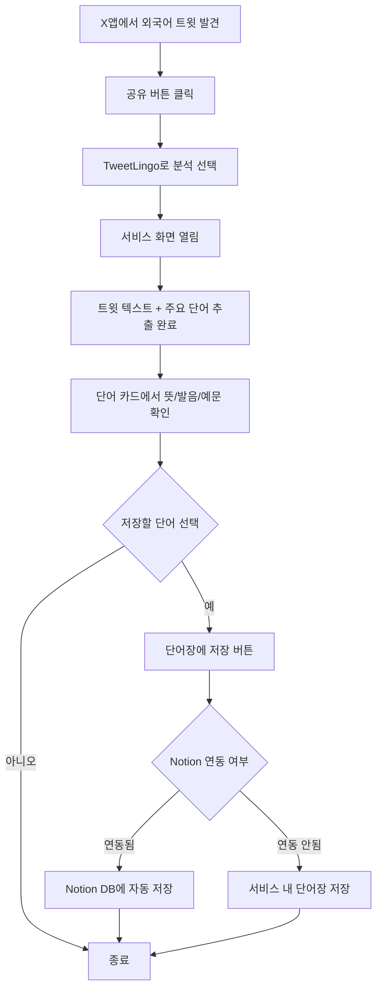
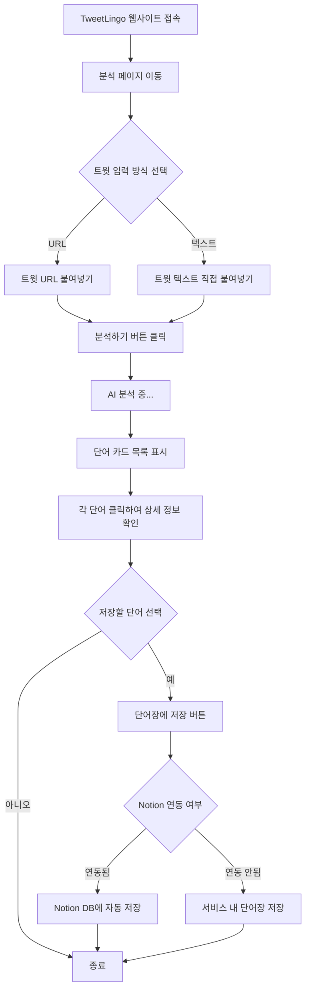
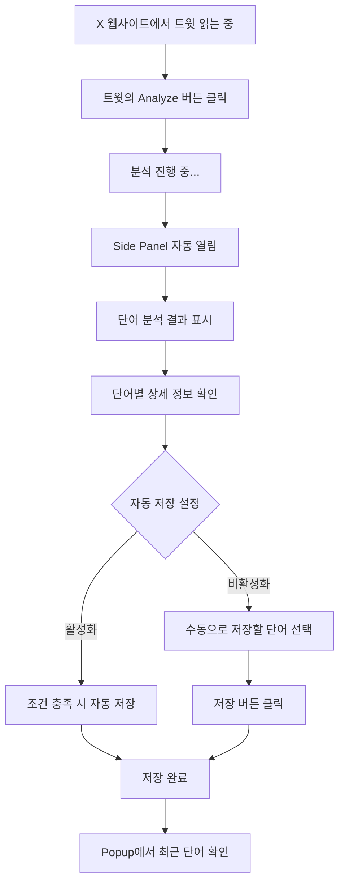
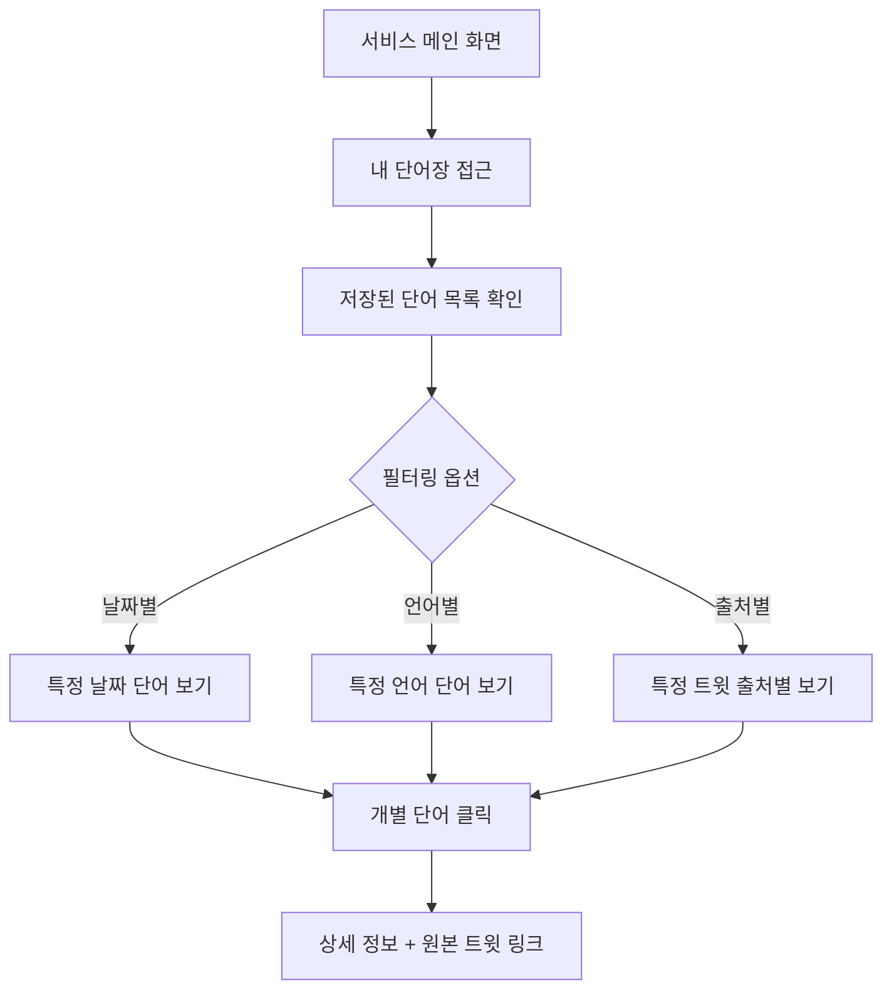
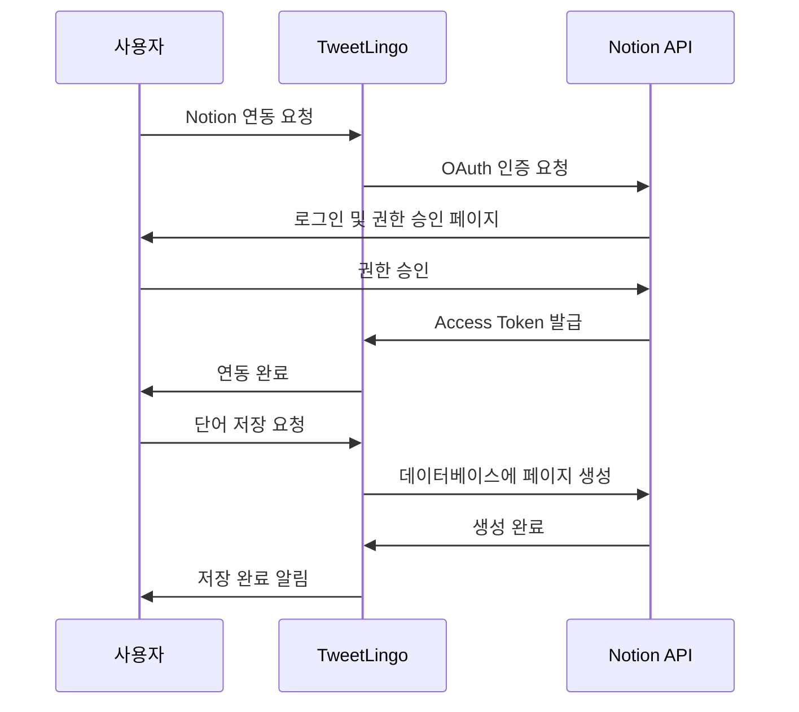
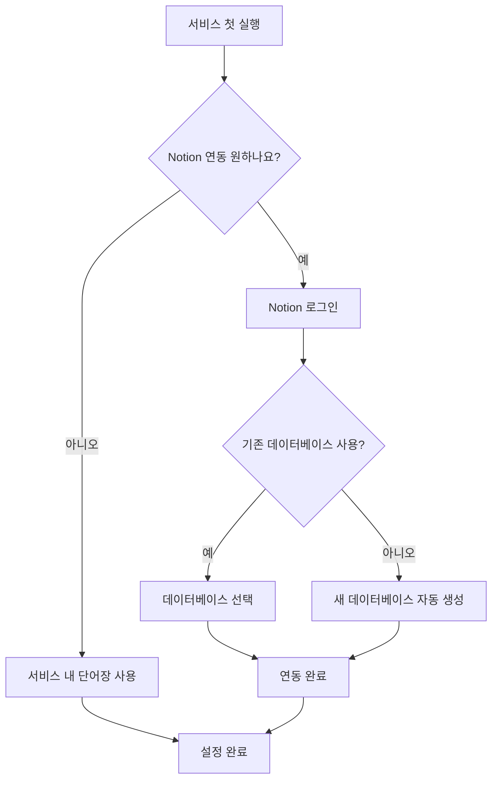
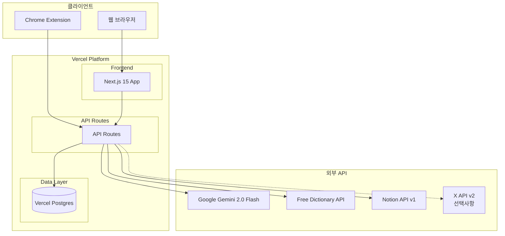
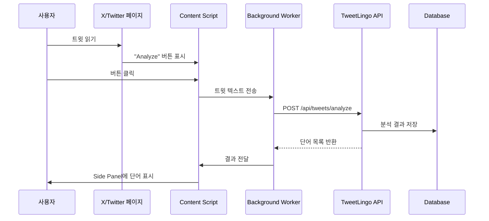
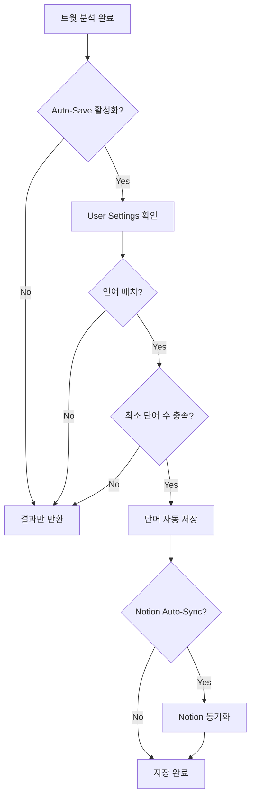
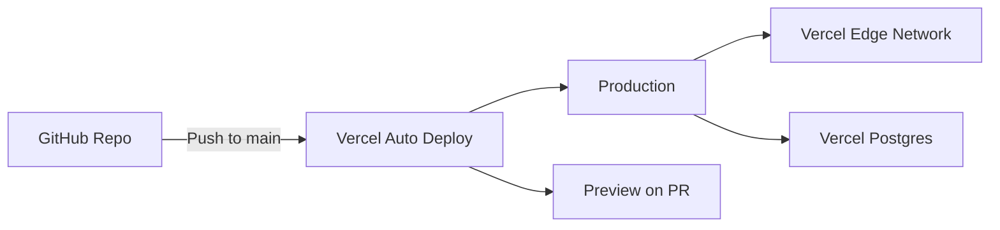

# X 트윗 언어학습 서비스 기획안

> 작성일: 2026년 1월 21일  
> 버전: 1.1 (웹 리서치 반영)

---

## 📋 목차

1. [서비스 개요](#1-서비스-개요)
2. [주요 기능](#2-주요-기능)
3. [사용자 플로우](#3-사용자-플로우)
4. [콘텐츠 규격](#4-콘텐츠-규격)
5. [Notion 연동 사양](#5-notion-연동-사양)
6. [기술 스택 및 n8n 워크플로우](#6-기술-스택-및-n8n-워크플로우)

---

## 1. 서비스 개요

### 1.1 서비스 컨셉

X(트위터)에서 외국어 트윗을 읽을 때, 모르는 단어를 자동으로 추출하고 학습할 수 있도록 돕는 **마이크로러닝 기반 실시간 언어 학습 도구**

**제안 서비스명:**

- **TweetLingo** - Tweet + Lingo(언어)의 조합 (추천)
- **WordFlow** - 트윗에서 자연스럽게 흐르는 단어 학습
- **SnapWord** - 트윗을 스냅하듯 빠르게 단어 학습

### 1.2 목적

- X 사용 중 자연스러운 외국어 노출을 학습 기회로 전환
- **문맥 기반 어휘 학습**: 실제 사용 예시를 통한 효과적인 언어 학습 (연구 결과: 고성능 학습자 22% 증가, 흥미도 84% 향상)
- **3-10분 마이크로러닝**: 짧고 집중된 학습 단위로 모바일 친화적 설계
- 번거로운 복사-붙여넣기 없이 즉각적인 단어 분석 제공

### 1.3 타겟 사용자

- X를 활발히 사용하는 외국어 학습자
- 여러 언어에 관심 있는 학생 및 다언어 사용자
- 실시간 콘텐츠를 통해 실용적인 언어를 배우고 싶은 사람

### 1.4 지원 언어

- **1차 지원 언어:** 영어, 일본어, 중국어
- **번역 방향:** 양방향 (예: 영어↔한국어, 일본어↔한국어, 중국어↔한국어 등)

---

## 2. 주요 기능

### 2.1 트윗 공유 연동

#### 지원 플랫폼
- **웹 애플리케이션** ✅: 트윗 URL 또는 텍스트를 직접 입력하여 분석
- **Chrome Extension** ✅: X/Twitter 페이지에서 원클릭으로 트윗 분석 (Phase 2)
- **iOS 공유 메뉴** 🔜: X 앱의 공유 메뉴 통합 (Phase 3)

#### 접근 방식
```
웹 앱: 분석 페이지에서 트윗 URL 또는 텍스트 입력
Chrome Extension: X 웹사이트에서 트윗의 "Analyze" 버튼 클릭
```

### 2.2 자동 단어 추출

#### 추출 로직
- 트윗 텍스트에서 주요 단어 자동 추출
  - **추출 대상**: 명사, 동사, 형용사, 부사 위주
  - **제외 대상**: 관사, 전치사, 접속사 등 기능어
- 언어 자동 감지 (영어/일본어/중국어)
- 특수 요소 처리 (해시태그, 멘션, 이모지 등)

#### 처리 예시
```
원본 트윗: "Just finished reading an amazing book about #AI! 🤖"
추출 단어: finished, reading, amazing, book, AI
```

### 2.3 단어 정보 제공

각 추출된 단어에 대해 다음 정보를 카드 형태로 표시:

| 정보 항목 | 설명 | 예시 |
|----------|------|------|
| **단어 원형** | 기본형 표시 | finish (finished의 원형) |
| **뜻/번역** | 사용자 설정 언어로 번역 | 끝내다, 완료하다 |
| **발음** | 언어별 발음 표기 | [ˈfɪnɪʃ] 또는 피니쉬 |
| **예문** | 원본 트윗 텍스트 활용 | Just finished reading... |

### 2.4 단어장 저장

#### 저장 옵션
1. **서비스 내 단어장**
   - 개인 단어장에 저장
   - 날짜별, 언어별, 출처별 필터링 지원
   - 복습 기능 제공

2. **Notion 연동** (선택사항)
   - 사용자의 Notion 데이터베이스에 자동 저장
   - 단어, 뜻, 발음, 예문, 출처(트윗 URL), 날짜 등 자동 입력
   - 사용자 커스텀 템플릿 활용 가능

---

## 3. 사용자 플로우

### 3.1 시나리오 1: iOS에서 사용 



**상세 단계:**
1. X 앱에서 흥미로운 외국어 트윗 발견
2. 공유 버튼 클릭 → "TweetLingo로 분석" 선택
3. 서비스 화면 열림
4. 트윗 텍스트 표시 + 주요 단어 자동 추출 완료
5. 각 단어 카드에서 뜻, 발음, 예문 확인
6. 저장하고 싶은 단어 선택 → "단어장에 저장" 버튼
7. (옵션) Notion 연동 시 자동으로 Notion 데이터베이스에 저장

### 3.2 시나리오 2: 웹 애플리케이션에서 직접 분석



**상세 단계:**
1. TweetLingo 웹사이트(https://tweetlingo.vercel.app)에 접속
2. 상단 메뉴에서 "분석" 페이지로 이동
3. 입력 방식 선택:
   - **옵션 A**: X에서 트윗 URL 복사 → 붙여넣기
   - **옵션 B**: 트윗 텍스트 직접 복사 → 붙여넣기 (URL 불필요)
4. "분석하기" 버튼 클릭
5. 2-3초 후 주요 단어가 카드 형태로 표시됨
6. 각 단어 카드를 클릭하면 발음, 뜻, 예문 확인 가능
7. 저장하고 싶은 단어 선택 후 "선택한 단어 저장하기" 버튼 클릭
8. (옵션) Notion 연동 시 자동으로 Notion 데이터베이스에도 저장
9. "내 단어장" 메뉴에서 저장된 단어 확인 및 복습

**특징:**
- ✅ X API 키 불필요 (텍스트 직접 입력 가능)
- ✅ 모바일/데스크톱 모두 지원 (반응형 디자인)
- ✅ 실시간 분석 및 즉시 결과 확인
- ✅ 자동 저장 설정 지원 (설정 페이지에서 활성화 가능)

### 3.3 시나리오 3: Chrome 확장 프로그램에서 사용



**상세 단계:**
1. Chrome에 TweetLingo Extension 설치
2. X(Twitter) 웹사이트 접속
3. 각 트윗 하단에 표시되는 "Analyze" 버튼 클릭
4. 자동으로 Side Panel이 열리며 단어 분석 결과 표시
5. 단어별 상세 정보 확인 (뜻, 발음, 예문)
6. 자동 저장 설정에 따라:
   - **자동 저장 ON**: 설정한 언어 및 최소 단어 수 조건 충족 시 자동 저장
   - **자동 저장 OFF**: 원하는 단어 수동 선택 후 저장
7. Extension Popup 아이콘 클릭하여 최근 저장된 단어 빠르게 확인
8. (옵션) Notion 자동 동기화 설정 시 Notion에도 자동 저장

**특징:**
- ✅ X API 키 불필요 (페이지에서 직접 텍스트 추출)
- ✅ 트윗을 읽으면서 바로 분석 가능 (원클릭)
- ✅ 자동 저장으로 번거로움 최소화
- ✅ Popup에서 최근 단어 빠른 복습

### 3.4 시나리오 4: 단어장 복습



**상세 단계:**
1. 서비스 메인 화면에서 "내 단어장" 접근
2. 저장된 단어 목록 확인
3. 날짜별, 언어별, 출처별 필터링
4. 개별 단어 클릭 시 상세 정보 및 원본 트윗 링크 확인

---

## 4. 콘텐츠 규격

### 4.1 단어 추출 기준

#### 추출 대상
- **명사** (Noun): book, AI, technology
- **동사** (Verb): read, finish, create
- **형용사** (Adjective): amazing, beautiful, difficult
- **부사** (Adverb): quickly, really, very

#### 제외 대상
- **관사**: a, an, the
- **전치사**: in, on, at, about
- **접속사**: and, but, or
- **기본 대명사**: I, you, he, she, it

#### 특수 처리

| 요소 | 처리 방법 | 예시 |
|------|----------|------|
| 해시태그 | # 제거 후 단어로 처리 | #AI → AI |
| 멘션 | 제외 | @username → 제외 |
| 이모지 | 제외 | 🤖 → 제외 |
| 숫자 | 제외 | 2024 → 제외 |
| URL | 제외 | https://... → 제외 |

### 4.2 표시 정보 상세

#### 단어 원형 표시
- **동사**: 원형 표시 (finished → finish)
- **명사**: 단수형 표시 (books → book)
- **형용사/부사**: 기본형 표시

#### 뜻 (번역)
- 해당 문맥에서의 의미를 우선 표시
- 다의어의 경우 가장 적합한 뜻 1-2개
- 사용자가 설정한 언어로 번역

#### 발음 표기

| 언어 | 표기 방식 | 예시 |
|------|----------|------|
| 영어 | IPA 또는 한글 발음 | [ˈfɪnɪʃ] / 피니쉬 |
| 일본어 | 히라가나/가타카나 독음 | 読む (よむ) |
| 중국어 | 병음(pinyin) + 성조 | 读 (dú) |

#### 예문
- **1차 예문**: 원본 트윗 텍스트 활용
- **추가 예문** (선택사항): 사전 API에서 제공하는 일반적인 예문

### 4.3 UI 표시 방식

#### 레이아웃 구조
```
┌─────────────────────────────┐
│  원본 트윗 텍스트            │
│  "Just finished reading..."  │
└─────────────────────────────┘

┌──────────┐ ┌──────────┐ ┌──────────┐
│ finish   │ │ read     │ │ amazing  │
│ 끝내다    │ │ 읽다      │ │ 놀라운    │
│ [접힘]   │ │ [접힘]   │ │ [접힘]   │
└──────────┘ └──────────┘ └──────────┘

클릭 시 ↓

┌─────────────────────────────┐
│ finish                      │
│ 끝내다, 완료하다              │
│                             │
│ 발음: [ˈfɪnɪʃ] 피니쉬        │
│ 예문: Just finished reading  │
│       an amazing book...    │
│                             │
│ [💾 저장하기]               │
└─────────────────────────────┘
```

#### 디자인 원칙
- **미니멀 스타일**: 필수 정보만 간결하게
- **카드형 레이아웃**: 단어별로 카드로 구분하여 가독성 확보
- **접기/펼치기**: 
  - 기본 상태: 단어 + 뜻만 표시
  - 클릭 시: 발음 + 예문 + 저장 버튼 표시
- **반응형**: 모바일/데스크톱 모두 최적화

---

## 5. Notion 연동 사양

### 5.1 연동 방식

#### 인증
- **Notion OAuth 2.0** 인증 사용
- 사용자가 직접 Notion 계정 연동 승인
- 필요 권한: 데이터베이스 읽기/쓰기

#### 연동 프로세스


### 5.2 저장 데이터 필드

#### 제안 Notion 데이터베이스 구조

| 필드명 | 타입 | 설명 | 예시 |
|--------|------|------|------|
| **단어 (Word)** | 제목(Title) | 학습한 단어 | finish |
| **뜻 (Meaning)** | 텍스트(Text) | 번역된 의미 | 끝내다, 완료하다 |
| **발음 (Pronunciation)** | 텍스트(Text) | 발음 표기 | [ˈfɪnɪʃ] |
| **예문 (Example)** | 텍스트(Text) | 사용 예시 | Just finished reading... |
| **언어 (Language)** | 선택(Select) | 원본 언어 | 영어 / 일본어 / 중국어 |
| **출처 (Source)** | URL | 원본 트윗 링크 | https://x.com/... |
| **학습 날짜 (Date)** | 날짜(Date) | 저장한 날짜 | 2026-01-21 |
| **상태 (Status)** | 선택(Select) | 학습 진행 상태 | 학습중 / 복습필요 / 완료 |

#### 데이터베이스 뷰 제안

1. **전체 보기** (Table): 모든 단어를 테이블로 표시
2. **언어별 보기** (Board): 언어별로 그룹화
3. **상태별 보기** (Board): 학습 상태별로 그룹화
4. **타임라인** (Timeline): 학습 날짜 기준 시간순 정렬

### 5.3 사용자 설정

#### 초기 설정 과정


#### 설정 옵션

| 설정 항목 | 옵션 | 기본값 |
|----------|------|--------|
| Notion 연동 | 활성화 / 비활성화 | 비활성화 |
| 데이터베이스 | 기존 선택 / 새로 생성 | 새로 생성 |
| 저장 방식 | 자동 저장 / 수동 저장 | 수동 저장 |
| 중복 확인 | 중복 단어 건너뛰기 / 항상 저장 | 중복 건너뛰기 |

#### 설정 변경
- 언제든지 설정에서 Notion 연동 활성화/비활성화 가능
- 데이터베이스 변경 가능
- 기존 저장된 데이터는 유지

---

## 6. 기술 스택 및 아키텍처

### 6.1 핵심 기술 스택

#### 프론트엔드
- **Next.js 15.2** - App Router 기반 React 프레임워크
- **React 19** - Server Components 지원 UI 라이브러리
- **TypeScript 5.7** - 타입 안정성 개발 언어
- **Tailwind CSS 4.1** - 유틸리티 우선 CSS 프레임워크
- **TanStack Query v5** - 서버 상태 관리
- **Zustand v5** - 클라이언트 상태 관리
- **Framer Motion 11** - 애니메이션 라이브러리

#### 백엔드
- **Next.js API Routes** - 서버리스 함수
- **Prisma ORM 6** - PostgreSQL 데이터베이스 ORM
- **Auth.js v5** - 인증 시스템 (Google OAuth)
- **Vercel Postgres** - 클라우드 데이터베이스 (Neon 호환)

#### Chrome 확장 프로그램
- **React 19** - UI 컴포넌트
- **Vite 5** - 빠른 빌드 도구
- **Manifest V3** - 최신 Chrome Extension 표준
- **TypeScript 5.7** - 타입 안정성

#### AI/NLP 엔진
- **Google Gemini 2.0 Flash** (주 엔진)
  - 다국어 NLP 및 품사 태깅
  - 문맥 분석 및 주요 단어 추출
  - 통합 번역 기능
  - 구조화된 JSON 출력 지원
- **Free Dictionary API** (단어 정의/발음)
  - 무료 사전 API
  - 발음, 정의, 예문 제공

#### 소셜 미디어 API
- **X API v2** (선택사항)
  - Chrome Extension이 페이지에서 직접 텍스트 추출 가능
  - API 키 없이도 Extension으로 완전 작동

#### 생산성 도구
- **Notion API v1**
  - OAuth 2.0 인증
  - Database 페이지 생성/업데이트
  - 자동 동기화 지원

#### 배포 및 인프라
- **Vercel** - Next.js 최적화 플랫폼, 자동 배포 (CI/CD)
- **Vercel Postgres (Neon)** - 서버리스 PostgreSQL 데이터베이스
- **Vercel Analytics** - 성능 및 사용자 분석 도구

### 6.2 시스템 아키텍처

#### 전체 구조



#### Chrome Extension 통신 플로우



### 6.3 데이터 흐름 상세

#### 웹 애플리케이션 분석 플로우

```
1. 사용자 → 트윗 URL 또는 텍스트 입력
2. Next.js API Route → 요청 수신 (/api/tweets/analyze)
3. Gemini API → 언어 감지 (en/ja/zh) + 품사 태깅 및 단어 추출
   - 명사, 동사, 형용사, 부사만 선택
   - 관사, 전치사, 접속사 제외
4. Gemini API → 각 단어 번역 (통합 처리)
5. Dictionary API → 정의 및 발음 조회
6. Prisma → 분석 결과 데이터베이스 저장
7. 클라이언트 → 결과 표시 (단어 카드)
8. 사용자 저장 요청 → 단어장 저장 + Notion 동기화 (선택)
```

#### Auto-Save 플로우 (Phase 2)



### 6.4 API 인증 및 설정

#### Google Gemini API
- **API Key** 방식 (Google AI Studio에서 발급)
- 무료 티어: 분당 15회 요청 제한
- 비용: $0.10/1M input tokens (2.0 Flash)

#### X API (선택사항)
- **Bearer Token**
- Chrome Extension 사용 시 불필요 (페이지에서 직접 추출)
- 무료 티어: 월 100회 읽기

#### Notion API
- **OAuth 2.0** (사용자별 연동)
- 권한: Database read/write
- 무료 (Notion 계정 필요)

#### Free Dictionary API
- 인증 불필요
- 무료 무제한
- 영어 단어 전용

### 6.5 배포 아키텍처



**배포 환경:**
- **개발(Development)**: 로컬 개발 환경 (클라우드 DB 사용)
- **프리뷰(Preview)**: PR별 자동 프리뷰 배포
- **프로덕션(Production)**: main 브랜치 자동 배포
- **지역(Region)**: ICN1 (서울, 대한민국)

---

## 개발 단계 현황

### Phase 1: MVP (웹 애플리케이션) ✅ 완료
- [x] 서비스명 최종 결정: **TweetLingo**
- [x] 와이어프레임 및 디자인 가이드 작성
- [x] Next.js 15.2 + React 19 프로젝트 구성
- [x] 트윗 분석 기능 (URL 또는 텍스트 직접 입력)
- [x] 단어 추출 및 정보 제공
- [x] 단어장 관리 (필터링, 상태 관리)
- [x] Notion OAuth 연동 및 자동 동기화
- [x] Google OAuth 인증
- [x] Vercel 배포

### Phase 2: Chrome Extension ✅ 완료
- [x] Chrome Extension Manifest V3 개발
- [x] Content Script (X/Twitter 페이지 통합)
- [x] Background Service Worker
- [x] Popup 및 Side Panel UI
- [x] Auto-Save 기능 구현
- [x] Settings API 개발
- [x] Extension 인증 플로우

### Phase 3: 고급 기능 🔜 계획 중
- [ ] iOS Share Extension 개발
- [ ] 고급 필터링 및 검색 기능
- [ ] 복습 알림 시스템 (Spaced Repetition)
- [ ] 학습 통계 대시보드
- [ ] 오디오 발음 재생
- [ ] 다국어 UI (i18n)
- [ ] PWA 오프라인 지원

---

---

## 문서 정보

- **작성일**: 2026년 1월 21일
- **최종 수정일**: 2026년 1월 23일
- **버전**: 2.0 (실제 구현 반영)
- **작성자**: 사용자와 AI의 협업
- **문서 유형**: 서비스 기획안
- **주요 변경사항**:
  - Phase 1 (MVP) 완료 반영
  - Phase 2 (Chrome Extension) 완료 반영
  - n8n 워크플로우 → Next.js + Chrome Extension 아키텍처로 변경
  - Gemini 2.0 Flash + Free Dictionary API 기술 스택 확정
  - Vercel + PostgreSQL 배포 환경 명시
  - Auto-Save 및 Extension 기능 추가
- **현재 상태**: Phase 1, 2 완료 / Phase 3 계획 중
