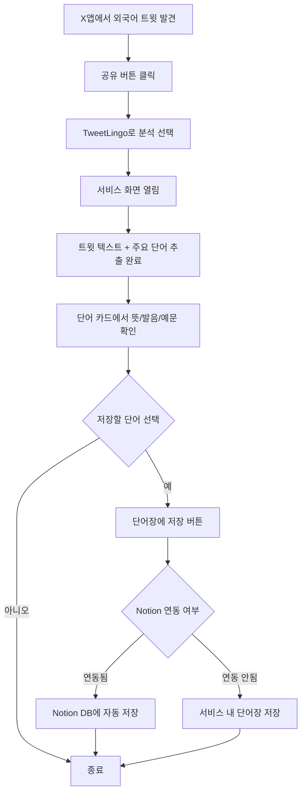
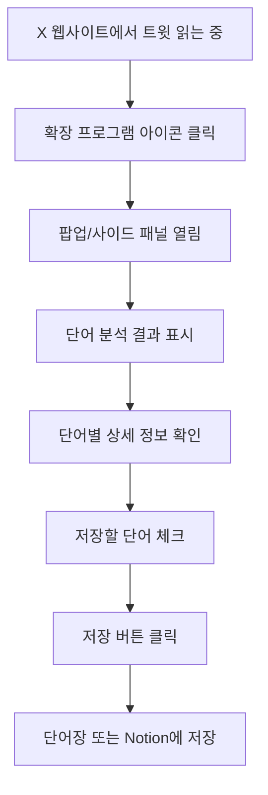
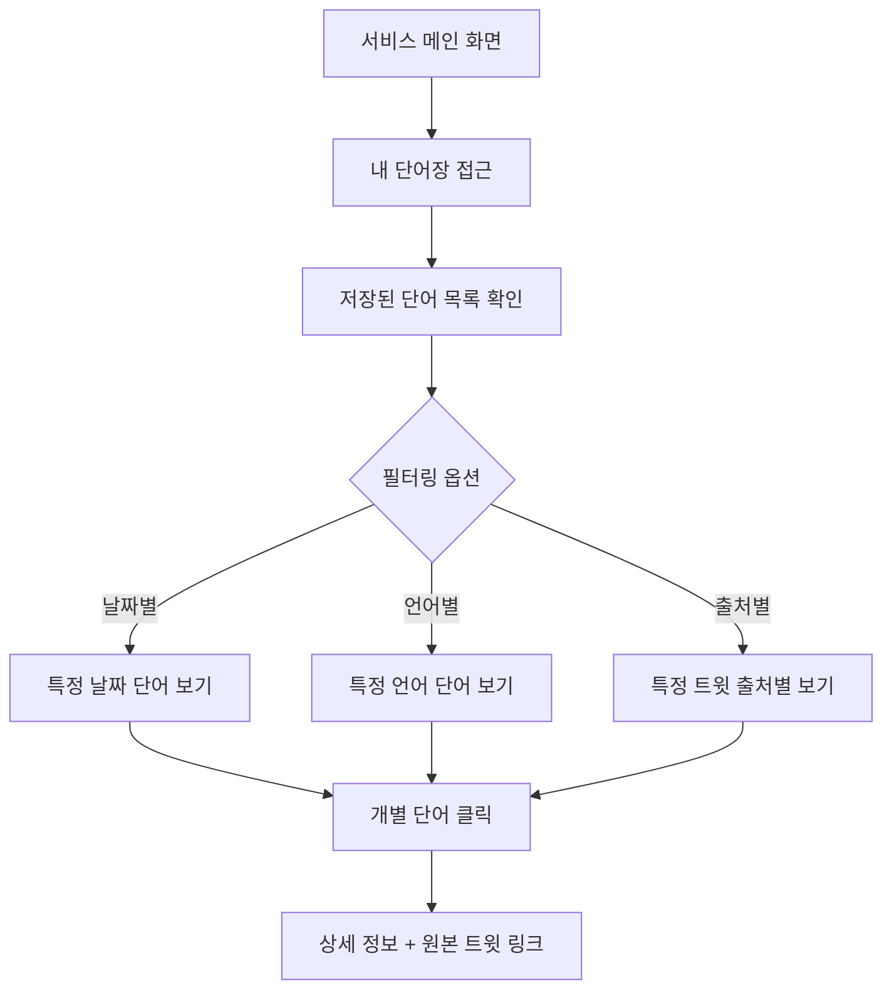
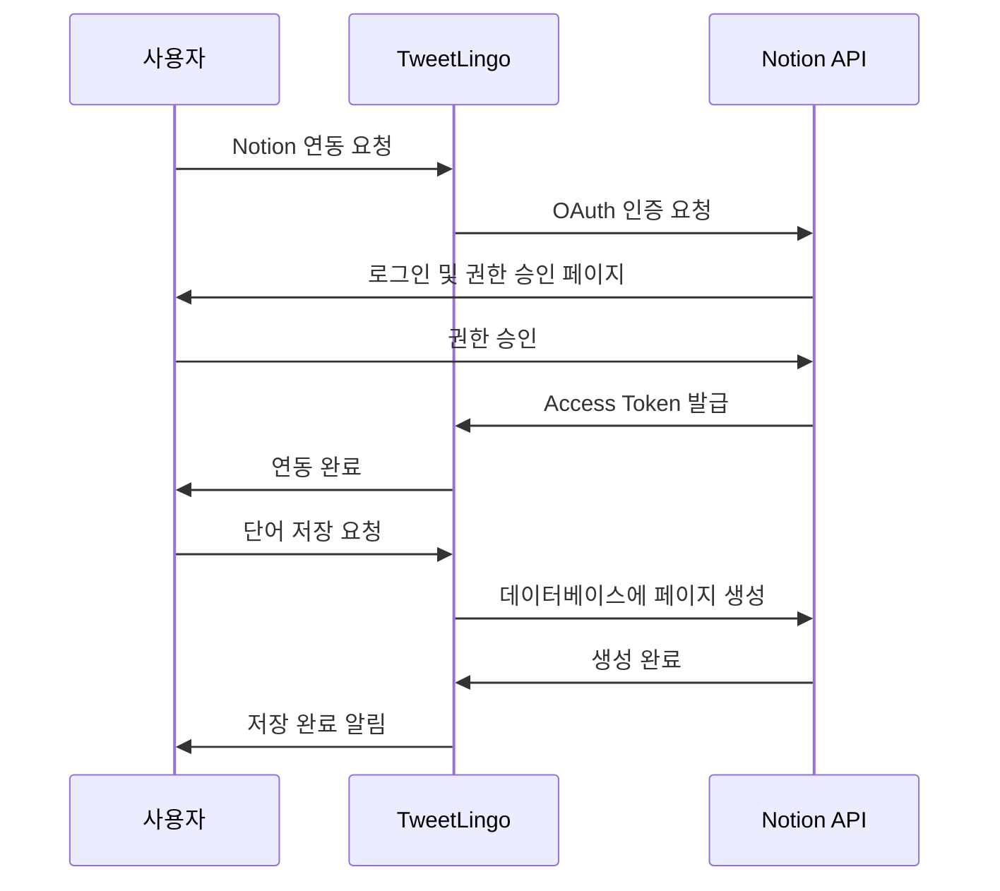
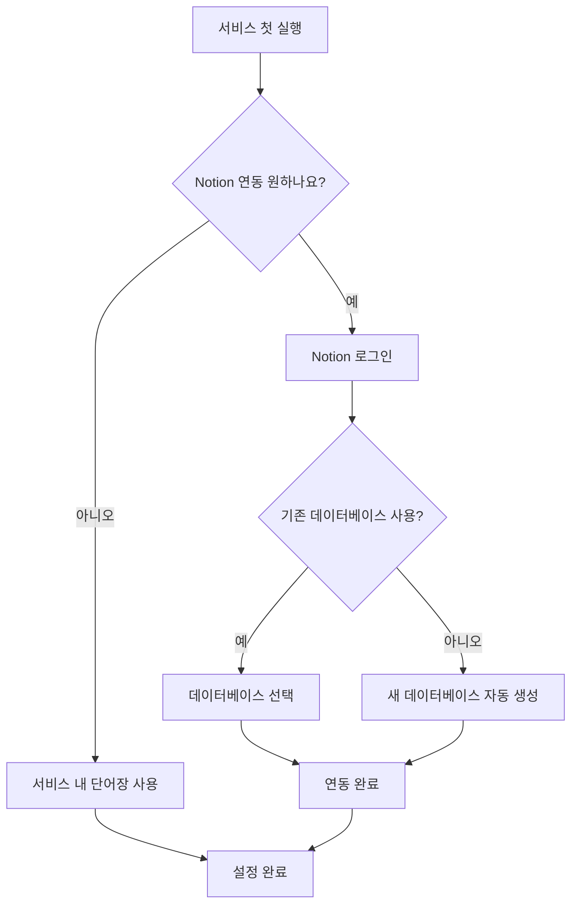
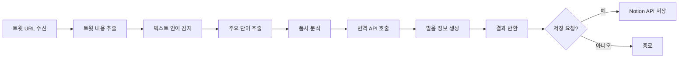

# X 트윗 언어학습 서비스 기획안

> 작성일: 2026년 1월 21일  
> 버전: 1.0

---

## 📋 목차

1. [서비스 개요](#1-서비스-개요)
2. [주요 기능](#2-주요-기능)
3. [사용자 플로우](#3-사용자-플로우)
4. [콘텐츠 규격](#4-콘텐츠-규격)
5. [Notion 연동 사양](#5-notion-연동-사양)
6. [부록](#부록-n8n-자동화-활용-포인트)

---

## 1. 서비스 개요

### 1.1 서비스 컨셉

X(트위터)에서 외국어 트윗을 읽을 때, 모르는 단어를 자동으로 추출하고 학습할 수 있도록 돕는 **실시간 언어 학습 도구**

**제안 서비스명:**

- **TweetLingo** - Tweet + Lingo(언어)의 조합
- **WordFlow** - 트윗에서 자연스럽게 흐르는 단어 학습
- **SnapWord** - 트윗을 스냅하듯 빠르게 단어 학습

### 1.2 목적

- X 사용 중 자연스러운 외국어 노출을 학습 기회로 전환
- 문맥 속 실제 사용 예시를 통한 효과적인 언어 학습
- 번거로운 복사-붙여넣기 없이 즉각적인 단어 분석 제공

### 1.3 타겟 사용자

- X를 활발히 사용하는 외국어 학습자
- 여러 언어에 관심 있는 학생 및 다언어 사용자
- 실시간 콘텐츠를 통해 실용적인 언어를 배우고 싶은 사람

### 1.4 지원 언어

- **1차 지원 언어:** 영어, 일본어, 중국어
- **번역 방향:** 양방향 (예: 영어↔한국어, 일본어↔한국어, 중국어↔한국어 등)

---

## 2. 주요 기능

### 2.1 트윗 공유 연동

#### 지원 플랫폼
- **iOS 공유 메뉴**: X 앱의 공유 메뉴에 서비스 옵션 통합
- **브라우저 확장 프로그램**: Chrome/Safari 등에서 트윗 페이지에서 즉시 분석
- **직접 입력**: 트윗 URL을 직접 입력하여 분석

#### 접근 방식
```
X 앱 → 공유 버튼 → "TweetLingo로 분석" 선택
X 웹 → 확장 프로그램 아이콘 클릭 또는 우클릭 메뉴
```

### 2.2 자동 단어 추출

#### 추출 로직
- 트윗 텍스트에서 주요 단어 자동 추출
  - **추출 대상**: 명사, 동사, 형용사, 부사 위주
  - **제외 대상**: 관사, 전치사, 접속사 등 기능어
- 언어 자동 감지 (영어/일본어/중국어)
- 특수 요소 처리 (해시태그, 멘션, 이모지 등)

#### 처리 예시
```
원본 트윗: "Just finished reading an amazing book about #AI! 🤖"
추출 단어: finished, reading, amazing, book, AI
```

### 2.3 단어 정보 제공

각 추출된 단어에 대해 다음 정보를 카드 형태로 표시:

| 정보 항목 | 설명 | 예시 |
|----------|------|------|
| **단어 원형** | 기본형 표시 | finish (finished의 원형) |
| **뜻/번역** | 사용자 설정 언어로 번역 | 끝내다, 완료하다 |
| **발음** | 언어별 발음 표기 | [ˈfɪnɪʃ] 또는 피니쉬 |
| **예문** | 원본 트윗 텍스트 활용 | Just finished reading... |

### 2.4 단어장 저장

#### 저장 옵션
1. **서비스 내 단어장**
   - 개인 단어장에 저장
   - 날짜별, 언어별, 출처별 필터링 지원
   - 복습 기능 제공

2. **Notion 연동** (선택사항)
   - 사용자의 Notion 데이터베이스에 자동 저장
   - 단어, 뜻, 발음, 예문, 출처(트윗 URL), 날짜 등 자동 입력
   - 사용자 커스텀 템플릿 활용 가능

---

## 3. 사용자 플로우

### 3.1 시나리오 1: iOS에서 사용



**상세 단계:**
1. X 앱에서 흥미로운 외국어 트윗 발견
2. 공유 버튼 클릭 → "TweetLingo로 분석" 선택
3. 서비스 화면 열림
4. 트윗 텍스트 표시 + 주요 단어 자동 추출 완료
5. 각 단어 카드에서 뜻, 발음, 예문 확인
6. 저장하고 싶은 단어 선택 → "단어장에 저장" 버튼
7. (옵션) Notion 연동 시 자동으로 Notion 데이터베이스에 저장

### 3.2 시나리오 2: 브라우저에서 사용



**상세 단계:**
1. X 웹사이트에서 트윗 읽는 중
2. 브라우저 확장 프로그램 아이콘 클릭 또는 트윗 우클릭 메뉴
3. 팝업 또는 사이드 패널에서 단어 분석 결과 표시
4. 단어별 상세 정보 확인
5. 단어장에 추가하고 싶은 단어 체크
6. "저장" 버튼으로 단어장 또는 Notion에 저장

### 3.3 시나리오 3: 단어장 복습



**상세 단계:**
1. 서비스 메인 화면에서 "내 단어장" 접근
2. 저장된 단어 목록 확인
3. 날짜별, 언어별, 출처별 필터링
4. 개별 단어 클릭 시 상세 정보 및 원본 트윗 링크 확인

---

## 4. 콘텐츠 규격

### 4.1 단어 추출 기준

#### 추출 대상
- **명사** (Noun): book, AI, technology
- **동사** (Verb): read, finish, create
- **형용사** (Adjective): amazing, beautiful, difficult
- **부사** (Adverb): quickly, really, very

#### 제외 대상
- **관사**: a, an, the
- **전치사**: in, on, at, about
- **접속사**: and, but, or
- **기본 대명사**: I, you, he, she, it

#### 특수 처리

| 요소 | 처리 방법 | 예시 |
|------|----------|------|
| 해시태그 | # 제거 후 단어로 처리 | #AI → AI |
| 멘션 | 제외 | @username → 제외 |
| 이모지 | 제외 | 🤖 → 제외 |
| 숫자 | 제외 | 2024 → 제외 |
| URL | 제외 | https://... → 제외 |

### 4.2 표시 정보 상세

#### 단어 원형 표시
- **동사**: 원형 표시 (finished → finish)
- **명사**: 단수형 표시 (books → book)
- **형용사/부사**: 기본형 표시

#### 뜻 (번역)
- 해당 문맥에서의 의미를 우선 표시
- 다의어의 경우 가장 적합한 뜻 1-2개
- 사용자가 설정한 언어로 번역

#### 발음 표기

| 언어 | 표기 방식 | 예시 |
|------|----------|------|
| 영어 | IPA 또는 한글 발음 | [ˈfɪnɪʃ] / 피니쉬 |
| 일본어 | 히라가나/가타카나 독음 | 読む (よむ) |
| 중국어 | 병음(pinyin) + 성조 | 读 (dú) |

#### 예문
- **1차 예문**: 원본 트윗 텍스트 활용
- **추가 예문** (선택사항): 사전 API에서 제공하는 일반적인 예문

### 4.3 UI 표시 방식

#### 레이아웃 구조
```
┌─────────────────────────────┐
│  원본 트윗 텍스트            │
│  "Just finished reading..."  │
└─────────────────────────────┘

┌──────────┐ ┌──────────┐ ┌──────────┐
│ finish   │ │ read     │ │ amazing  │
│ 끝내다    │ │ 읽다      │ │ 놀라운    │
│ [접힘]   │ │ [접힘]   │ │ [접힘]   │
└──────────┘ └──────────┘ └──────────┘

클릭 시 ↓

┌─────────────────────────────┐
│ finish                      │
│ 끝내다, 완료하다              │
│                             │
│ 발음: [ˈfɪnɪʃ] 피니쉬        │
│ 예문: Just finished reading  │
│       an amazing book...    │
│                             │
│ [💾 저장하기]               │
└─────────────────────────────┘
```

#### 디자인 원칙
- **미니멀 스타일**: 필수 정보만 간결하게
- **카드형 레이아웃**: 단어별로 카드로 구분하여 가독성 확보
- **접기/펼치기**: 
  - 기본 상태: 단어 + 뜻만 표시
  - 클릭 시: 발음 + 예문 + 저장 버튼 표시
- **반응형**: 모바일/데스크톱 모두 최적화

---

## 5. Notion 연동 사양

### 5.1 연동 방식

#### 인증
- **Notion OAuth 2.0** 인증 사용
- 사용자가 직접 Notion 계정 연동 승인
- 필요 권한: 데이터베이스 읽기/쓰기

#### 연동 프로세스


### 5.2 저장 데이터 필드

#### 제안 Notion 데이터베이스 구조

| 필드명 | 타입 | 설명 | 예시 |
|--------|------|------|------|
| **단어 (Word)** | 제목(Title) | 학습한 단어 | finish |
| **뜻 (Meaning)** | 텍스트(Text) | 번역된 의미 | 끝내다, 완료하다 |
| **발음 (Pronunciation)** | 텍스트(Text) | 발음 표기 | [ˈfɪnɪʃ] |
| **예문 (Example)** | 텍스트(Text) | 사용 예시 | Just finished reading... |
| **언어 (Language)** | 선택(Select) | 원본 언어 | 영어 / 일본어 / 중국어 |
| **출처 (Source)** | URL | 원본 트윗 링크 | https://x.com/... |
| **학습 날짜 (Date)** | 날짜(Date) | 저장한 날짜 | 2026-01-21 |
| **상태 (Status)** | 선택(Select) | 학습 진행 상태 | 학습중 / 복습필요 / 완료 |

#### 데이터베이스 뷰 제안

1. **전체 보기** (Table): 모든 단어를 테이블로 표시
2. **언어별 보기** (Board): 언어별로 그룹화
3. **상태별 보기** (Board): 학습 상태별로 그룹화
4. **타임라인** (Timeline): 학습 날짜 기준 시간순 정렬

### 5.3 사용자 설정

#### 초기 설정 과정


#### 설정 옵션

| 설정 항목 | 옵션 | 기본값 |
|----------|------|--------|
| Notion 연동 | 활성화 / 비활성화 | 비활성화 |
| 데이터베이스 | 기존 선택 / 새로 생성 | 새로 생성 |
| 저장 방식 | 자동 저장 / 수동 저장 | 수동 저장 |
| 중복 확인 | 중복 단어 건너뛰기 / 항상 저장 | 중복 건너뛰기 |

#### 설정 변경
- 언제든지 설정에서 Notion 연동 활성화/비활성화 가능
- 데이터베이스 변경 가능
- 기존 저장된 데이터는 유지

---

## 부록: n8n 자동화 활용 포인트

기획안에서는 기술 구현을 제외하지만, 서비스 관점에서 n8n 자동화가 처리할 부분:

### 자동화 워크플로우 개요



### 처리 단계

1. **트윗 URL 수신** → 트윗 내용 추출
2. **텍스트 언어 감지** (영어/일본어/중국어 구분)
3. **주요 단어 추출** 및 품사 분석
4. **각 단어의 번역, 발음, 예문** API 호출
5. **Notion API**를 통한 데이터 저장 (연동 시)

---

## 다음 단계

### 단계 1: 서비스 디자인
- [ ] 서비스명 최종 결정 (TweetLingo / WordFlow / SnapWord 중 선택)
- [ ] 와이어프레임 작성 (사용자 제작 예정)
- [ ] 디자인 가이드 작성 (사용자 제작 예정)

### 단계 2: 기술 개발
- [ ] 기술 스택 및 구현 방안 검토
- [ ] n8n 워크플로우 설계
- [ ] API 연동 테스트 (X API, 번역 API, Notion API)

### 단계 3: 프로토타입
- [ ] MVP 기능 개발 (트윗 분석 + 단어 추출)
- [ ] iOS 공유 확장 개발
- [ ] 브라우저 확장 프로그램 개발
- [ ] Notion 연동 구현

### 단계 4: 테스트 및 출시
- [ ] 베타 테스트
- [ ] 사용자 피드백 수집
- [ ] 정식 출시

---

## 문서 정보

- **작성일**: 2026년 1월 21일
- **버전**: 1.0
- **작성자**: 사용자와 AI의 협업
- **문서 유형**: 서비스 기획안 (비기술)
- **다음 작업**: 와이어프레임 및 디자인 가이드 작성 예정
